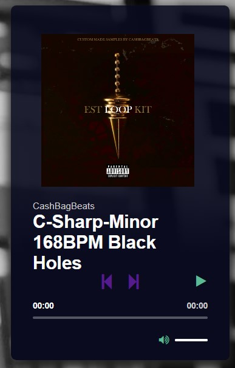

# beat-player

Django-based beat player web app using HTML, Jinja, CSS, and Javascript. 

Beats are added via the admin interface.

# Source
This web app is based on the tutorial by [Onojakpor Ochuko](https://www.section.io/engineering-education/how-to-build-a-music-player-using-django/).
(See the full tutorial repo [here](https://github.com/Chukslord1/DjangoMusicPlayer).)